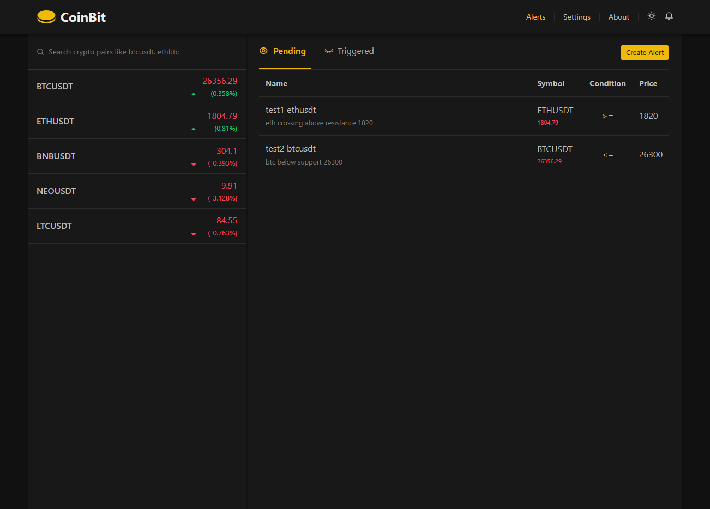

# CoinBit React App

Get real-time cryptocurrency data updates and customized price alerts with CoinBit React App. Built using React and the Binance websocket API, this app is the ultimate tool for traders looking to stay ahead of the game.

## Features

- Real-time cryptocurrency data updates from the Binance WebSocket API.
- Create a custom watchlist to monitor your favorite cryptocurrencies.
- Set custom price alerts with options to send notifications to Discord.
- Responsive design for seamless usage on mobile, tablet, and desktop devices.
- Dark and light mode options for personalized user preference.
- Accessible via screen reader, easy Tab key navigation.

## Technologies Used

- HTML, CSS (SCSS), and React.
- Hosted on Netlify for easy deployment.
- Binance WebSocket API for real-time cryptocurrency data.
- Discord Webhook API for sending price alerts to Discord.

## Disclaimer

- **No user data stored:** This app does not store any user data on the server. User preferences and settings are stored in the browser's local storage.
- **For demonstration purposes:** CoinBit React app is intended for demonstration purposes only and should not be used for actual trading. We are not liable for any losses incurred through the use of this app.

## Getting Started

### Prerequisites

Before running the project, make sure you have the following software installed on your machine:

- Node.js (version 14 or above)
- npm (Node Package Manager)

To run the CoinBit React app locally, follow these steps:

1. Clone the repository: `git clone https://github.com/aashutoosh/CoinBit-React-App.git`
2. Navigate to the project directory: `cd CoinBit-React-App`
3. Install the dependencies: `npm install`

### Usage

1. Start the development server: `npm run dev`
   This will launch the development server using Vite and enable hot module replacement for faster development.

2. Open your browser and visit [http://localhost:5173](http://localhost:5173) to see the app in action.

### Building the Project

To build the project for production, run the following command: `npm run build`
This will create an optimized and minified version of the project in the `dist` directory.

### Linting and Formatting

To lint the JavaScript and JSX files using ESLint, run the following command: `npm run lint`
To automatically fix linting issues, run: `npm run lintfix`
To format the codebase using Prettier, run: `npm run format`

## Contributing

Contributions are welcome! If you have bug fixes, feature suggestions, or improvements, please follow these steps:

1. Fork the repository.
2. Clone the project to your machine.
3. Create a new branch: `git checkout -b feature/your-feature`
4. Make your changes and commit them: `git commit -m 'Add some feature'`
5. Push your changes to the branch: `git push origin feature/your-feature`
6. Open a pull request on GitHub, explaining your changes and their benefits.

Please ensure that your code follows the project's ESLint rules and coding conventions. The configuration files for ESLint and Prettier are already provided in the project.

## Support

For any questions, issues, or support requests, please open an issue on our GitHub Issues page.
